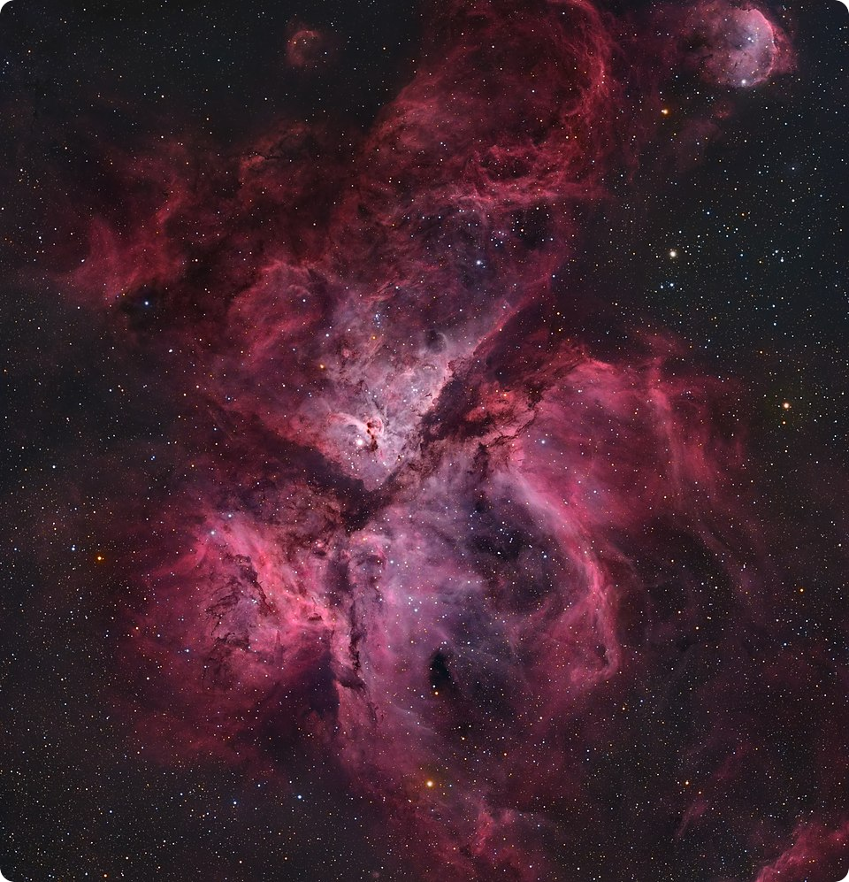

<div align="center">



<br>

# nebula

**arm64 linux position-independent shellcode framework**

</div>

<br>

## why

no good equivalent for arm64 linux.   nebula provides a minimal pic shellcode template that resolves symbols at runtime.   self-contained, injectable anywhere (pretty much). 

<br>

## how

> **`_start`**
> --> compute runtime base via `adr x20, __start`
> --> call `nebula_entry`
>
> **`nebula_entry`**
> --> parse `/proc/self/maps` --> find libc base
> --> walk `DT_SYMTAB` / `DT_STRTAB` --> resolve `write`, `mmap`, ...
> --> populate `ctx->libc.*`
> --> exec payload

<br>

## resolution

**modules**

parse `/proc/self/maps`, extract name from path, djb2 hash.   if hash matches and base contains valid elf64 header, return base.

**symbols**

locate `PT_DYNAMIC`, extract `DT_SYMTAB`/`DT_STRTAB`/`DT_STRSZ`. iterate symbol table, hash each name, compare.   match --> return `base + st_value`.

<br>

## syscalls

inline asm.   arm64 linux convention:   `x8` = nr, `x0-x5` = args, `svc #0`

```c
static inline i64 sys_write(i32 fd, const void *buf, size_t n)
{
    register i64 x0 asm("x0") = fd;
    register i64 x1 asm("x1") = (i64) buf;
    register i64 x2 asm("x2") = n;
    register i64 x8 asm("x8") = 64;
    asm volatile("svc #0" : "+r"(x0) : "r"(x1),"r"(x2),"r"(x8) : "memory");
    return x0;
}
```

<br>

## pic

| flag               | purpose              |
|--------------------|----------------------|
| `-fPIE`            | position independent |
| `-mcmodel=tiny`    | ±1MB pc-relative     |
| `-fno-plt`         | no PLT stubs         |
| `-fno-jump-tables` | no absolute jumps    |

linker script starts at 0, contiguous sects.   `__start`/`__end` markers for size calc.

<br>

## ctx

```c
nebula_ctx_t
{
    self  { base, size, crc }
    proc  { pid, comm }
    libc  { base, write, read, mmap, mprotect, munmap, exit }
    ready
}
```

<br>

## proj files

| path             | desc                       |
|------------------|----------------------------|
| `src/entry.S`    | entry stub                 |
| `src/nebula.c`   | core runtime               |
| `include/*. h`    | types, elf, syscalls, hash |
| `test/loader.c`  | simple ass loader          |

<br>

## build

```bash
make
# if you wanna use my loader
gcc -o bin/loader test/loader.c -Wall
./bin/loader bin/nebula.bin
```

<br>

## usage

pls impl `nebula_exec()`:

```c
void nebula_exec(nebula_ctx_t *ctx)
{
    ctx->libc.write(2, "hi\n", 3);
}
```

<br>

## references

- [Cracked5pider/Stardust](https://github.com/Cracked5pider/Stardust)
- [arm64.syscall.sh](https://arm64.syscall.sh)
- my own code for other previous projects
